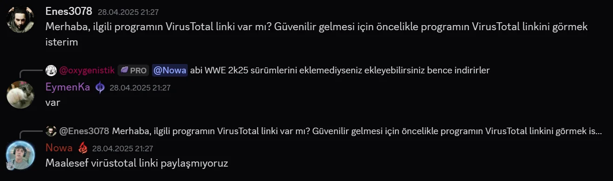
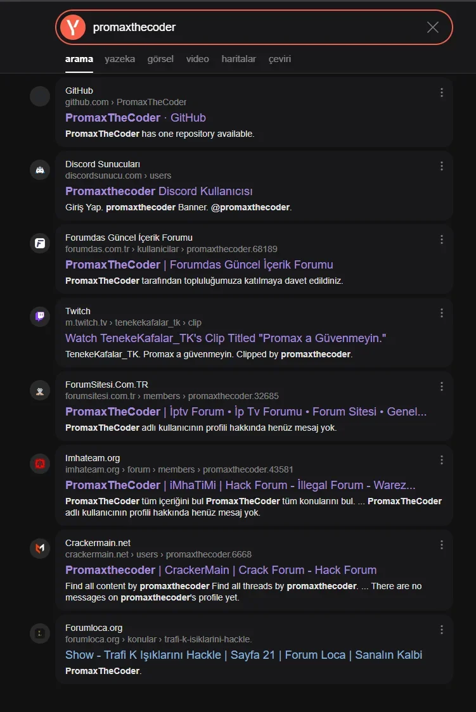
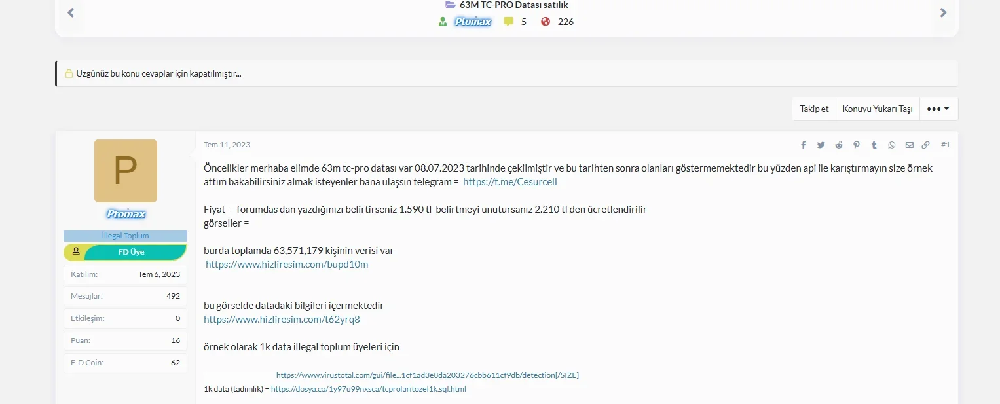
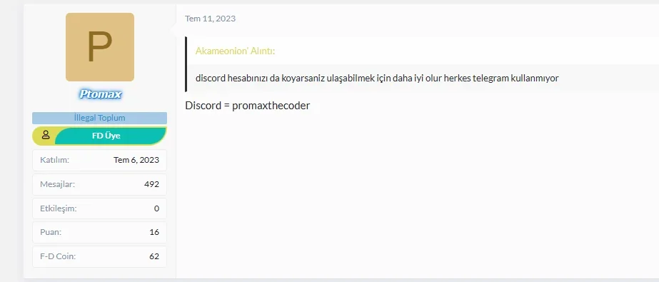
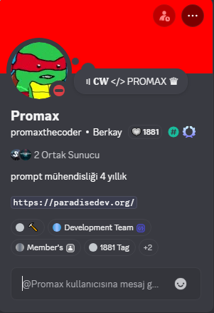
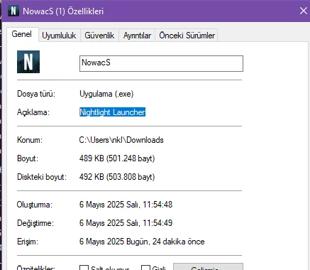
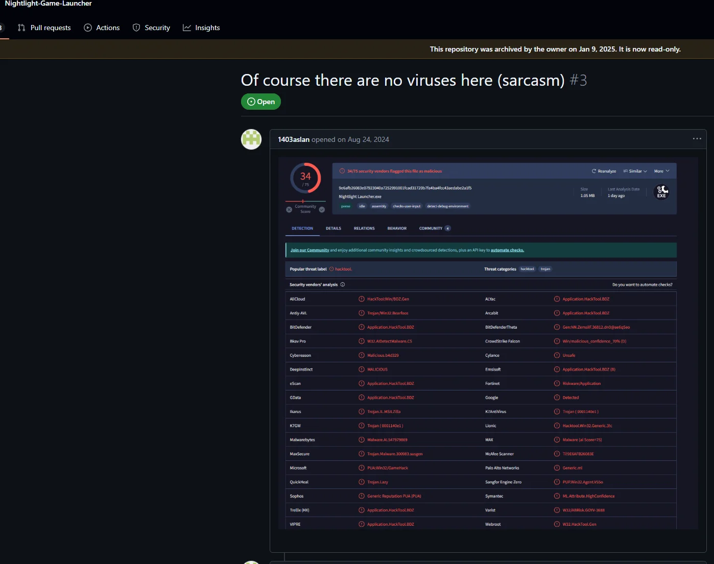

---

## 📸 Kanıt Galerisi

### Kanıt 1

Açıklama: Burada topluluğun geliştirdiği programın **virüslü olabileceği** görülüyor. VirusTotal sonuç vermeyi reddediyor, bu da riskli olduğuna işaret ediyor.

---

### Kanıt 2

Açıklama: Promax isimli kişinin **illegal forumlar ve topluluklara üyeliği** kanıtlanıyor.

---

### Kanıt 3

Açıklama: Promax, Forumdas isimli forumda **63 milyon Türkiye vatandaşının SQL datasını 1590 TL karşılığında satıyor**.  
Topluluk üyelerinin güvenmesi için **1000 Türkiye vatandaşının datasını ücretsiz veriyor**.

---

### Kanıt 4

Açıklama: Burada **Promax’ın açıkça Discord adresini verdiği** görülüyor.

---

### Kanıt 5

Açıklama: Paradise Development’in en gözde geliştiricilerinden Promax’ın **aslen bir panelci olduğu** ortaya çıkıyor. Önceki fotoğraflarla ilişkilendiriliyor.

---

### Kanıt 6

Açıklama: Burada uygulamalarının altyapısının **Nightlight Launcher’den alındığı** kanıtlanıyor.

---

### Kanıt 7

Açıklama: Nightlight Launcher’in VirusTotal sonucunda **75 antivirüsten 34’ü uyarı vermiş**, bu da **Nowacs programının aslında bir virüs yuvası** olduğunu gösteriyor.

---

## ⚖ Uyarı ve Amaç

Bu depo **sadece belgeleme ve farkındalık amacıyla** hazırlanmıştır.  
Amaç:

- Kanıtların saklanması
- Araştırma ve inceleme
- Topluluğun yasa dışı faaliyetlerinin anlaşılması

Bireylere yönelik taciz veya hedefleme amaçlanmamıştır.

---

## 📬 İletişim

Ek kanıt veya bilgi göndermek isteyenler:  
📧 mistikzimbappe@gmail.com

---

# ⭐ Arşiv Notu

Repo, kanıt bütünlüğünü korumak için gerektiğinde **arşivlenebilir**.
